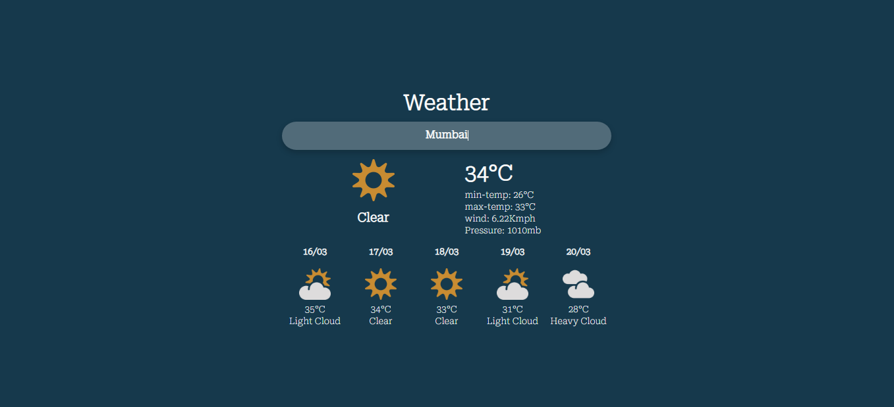

# weather-app

It is a simple webpage where you can get weather information, based on the city you enter. The features include the current temperature, minimum temperature of today, maximum temperature of today, wind speed, air pressure of today, as well as the temperature upcoming five days with weather state name.

## Screenshot

## [Live Demo](https://AkshayManiar.github.io/weather-app/)

## Getting Started

First of all you need an API from [metaweather](https://www.metaweather.com/api/), you can get it by creating an account on their website or you can use it for free by searching weather api on their website. After you get the API fetch the data from it and convert it into JSON file and use the data as per your convenience.

### Note:
If you run it on your local server than you might get an error like
`Access to fetch at 'https://www.metaweather.com/api/location/search/?query=Mumbai' from origin 'http://127.0.0.1:5500' has been blocked by CORS policy: No 'Access-Control-Allow-Origin' header is present on the requested resource. If an opaque response serves your needs, set the request's mode to 'no-cors' to fetch the resource with CORS disabled.`

_It because If you don’t control the server your frontend code is sending a request to, and the problem with the response from that server is just the lack of the necessary Access-Control-Allow-Origin header, you can still get things to work—by making the request through a CORS proxy._
**Solution:**
Download an Extension in Google Chrome - [Moesif Origin & CORS Changer](https://chrome.google.com/webstore/detail/moesif-origin-cors-change/digfbfaphojjndkpccljibejjbppifbc).
This plugin allows you to send cross-domain requests. You can also override Request Origin and CORS headers. **OR** get CORS proxy server which enables cross-origin requests to anywhere. I have used [allOrigins](https://allorigins.win/) which is an interesting javascript solution in that content is pulled via the API in JSON/P or raw, and then delivered to the client for further use or transformation.

## Credits

- [metaweather](https://www.metaweather.com/api/)(Weather data API) 
- [allOrigins](https://allorigins.win/)(Proxy Server)
- [Commercial Type & Greg Gazdowicz](https://fonts.google.com/specimen/Roboto+Serif?query=roboto+ser)(Fonts)
